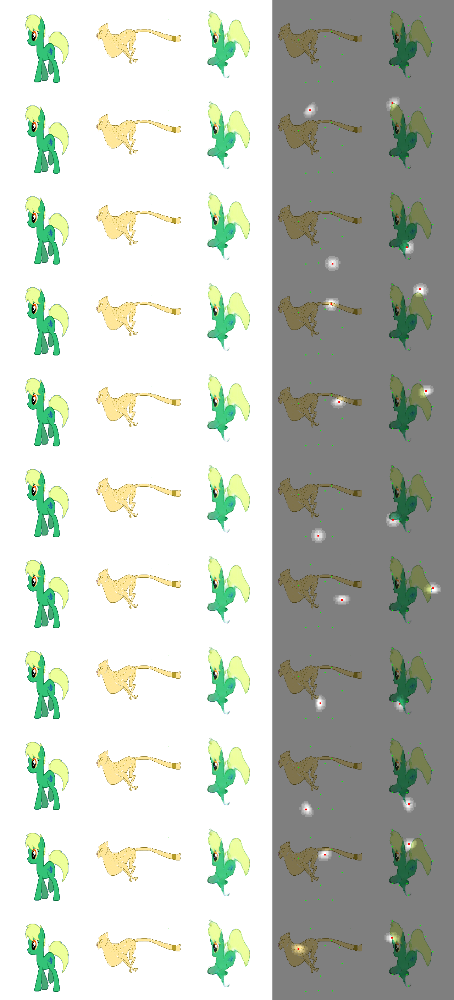
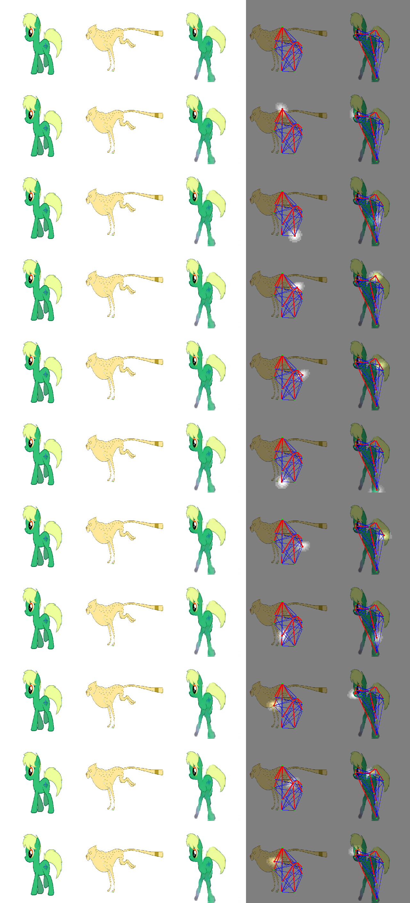

# Unsupervised Key Point Learning with Graph

## Motivation

Auther: Hui-Yu Huang (purelyvivid@gmail.com, NCTU) 2020/06

First-Order-Model[1] (NIPS 19), an advanced image animation approach by unsupervised key point detection, has shown extraordinary capability in sparse motion transformation. However, number of key points is a preset hyperparameter and key points learn independently on each heatmaps.

To leverage the relation between key points, I propose a method which regards key points as a **Graph**, modeled by Attention-Based Graph Neural Network. **Graph constraints the key points and shows how key points related to each other, providing informative prior for model training, and can be visualized for human understanding.**

## Proposed Model

## Result
- Original Model

- Proposed Model

## Visualization
- Original Model

- Proposed Model

## Reference

[1] This repository is modefied from the [source code](https://github.com/AliaksandrSiarohin/first-order-model/) for the paper [First Order Motion Model for Image Animation](https://papers.nips.cc/paper/8935-first-order-motion-model-for-image-animation) 
